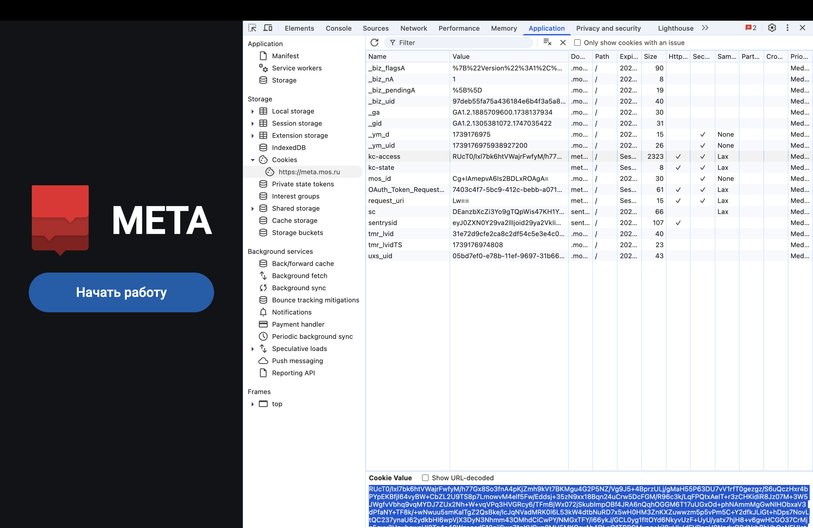

# Содержание

* [Установите Docker](#установите-docker)
* [Настройка окружения с помощью .env файла](#настройка-окружения-с-помощью-env-файла)
* [Использование переменных](#использование-переменных)
* [Безопасность](#безопасность)
* [Проверка конфигурации](#проверка-конфигурации)
* [Обновление переменных или запуск работы сервера](#обновление-переменных-или-запуск-работы-сервера)

## Установите Docker

По ссылке: https://docs.docker.com/get-started/get-docker/

# Настройка окружения с помощью .env файла
## Введение
Файлы используются для хранения конфиденциальных переменных окружения, которые требуются для правильной работы приложения. Этот документ поможет вам правильно настроить файл `.env` для вашего проекта.
## Шаги настройки
### 1. Создание файла .env
1. Найдите файл в директории проекта `/proxy/.env.example`.
2. Скопируйте этот файл в ту же директорию.
3. Переименуйте копию в `.env` (без расширения `.example`).

Или воскользуйтесь командой:
```bash
   cp .env.example .env
```

### 2. Заполнение переменных
Откройте созданный файл и заполните необходимые переменные:

```bash
KC_ACCESS_TOKEN=<ваш_токен>           # Ваш токен доступа
META_HOST=<host_адрес_meta>           # Host-адрес сайт meta (например meta-dev.mos.ru)
```

Чтобы скопировать KC_ACCESS_TOKEN:
1. Перейдите по ссылке: meta.mos.ru.
2. Авторизуйтесь на стенде и перейдите в Dev Tools.
3. Перейдите в раздел Application и откройте Cookies.
4. Нажмите на поле ks-access и скопируйте токен в нижней правой части экрана (токен живет ограниченное время и обновляется при каждом logout)

   Скриншот:
   

#### Значения для файла .env

##### Prod-окружение
```
META_HOST=meta.mos.ru
```
##### Stage-окружение
```
META_HOST=meta-stage.mos.ru
```
##### Dev-окружение
```
META_HOST=meta-dev.mos.ru
```

### 3. Формат переменных

- Переменные объявляются в формате `КЛЮЧ=ЗНАЧЕНИЕ`
- Не используйте пробелы вокруг знака равенства
- Не заключайте значения в кавычки, если это не требуется
- Каждая переменная должна быть на новой строке

# Использование переменных
Переменные из файла доступны в различных конфигурационных файлах проекта: `.env`
- через директиву `docker-compose.yml` в `env_file`
- через шаблонный синтаксис `{{ env "ИМЯ_ПЕРЕМЕННОЙ" }}` в `traefik-dynamic.yml`

# Безопасность
- **Никогда не добавляйте** файл `.env` в систему контроля версий
- Файл уже добавлен в `.gitignore`
- Используйте шаблон `.env.example` с примерами переменных без реальных значений

# Проверка конфигурации
После настройки файла убедитесь, что все переменные правильно заполнены, запустив:

```bash
docker-compose config
```

Команда покажет результирующую конфигурацию с подставленными значениями переменных.

# Обновление переменных или запуск работы сервера

Перейдите в папку

```bash
cd proxy
```

Если файлы были изменены, перезапустите контейнеры:

```bash
docker compose down
docker compose up -d

```

добавьте в файл [environment.development.ts](../src/environments/environment.development.ts)
строчку `proxyHost: 'http://localhost:2233',`

Далее, например, прописываете в файле `src/config.json`:

```
"PGM_SETTINGS_URL": "/datahub/dictionaries/v1/9509/values?attributes=NAME,DEFAULT_VALUE,URL_ADDRESS,OPTIONS",
```
