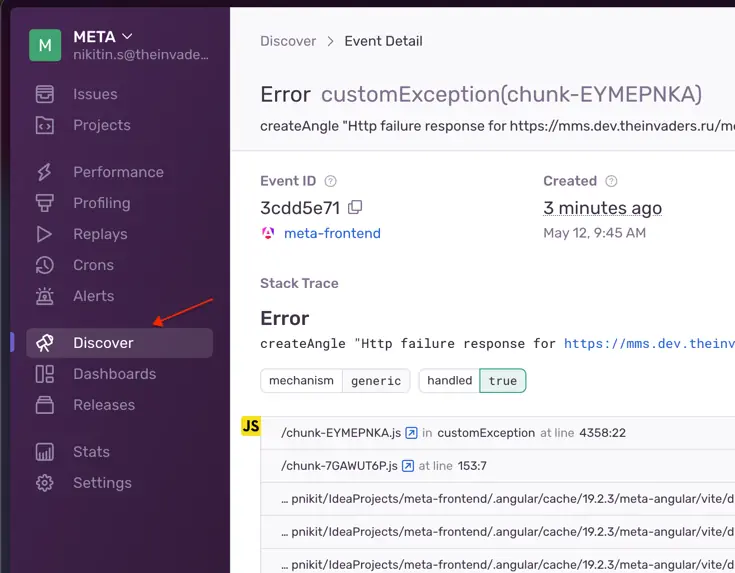
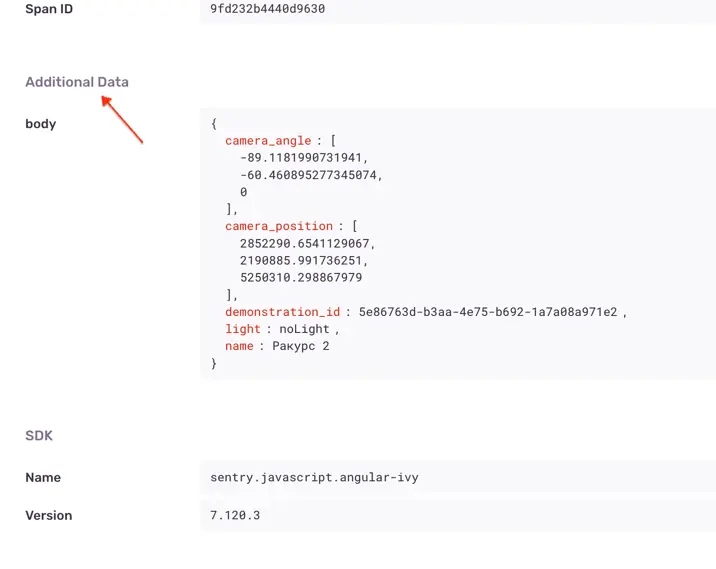

## Поиск ошибок при обращении к API с помощью sentry

При вызове методов сторонних API все ситуации с ошибками отлавливаются и логируются посредством Sentry.
```ts
 catchError((err) => {
  customException({ msg: 'method_name', err, extra: { body: angle } });
  throw err;
}),
```
где:
 - `method_name` - имя метода для идентификации в sentry
 - `err` - сама ошибка
- `extra` - доп информация, в примере body http запроса

### Шаги для поиска интересующей нас ошибки с экстра информацией в sentry
- Зайти на нужный контур sentry (dev/prod)
- в панели навигации слева выбрать Discover


- ориентируясь на `method_name` найти интересующий вызов метода
- после перехода на страницу нужной ошибки прокрутить вниз до подпункта "Additional Data"
в нем будет представлена вся доп информация, которая содержалась в `extra`
в случае примера "body" запроса

